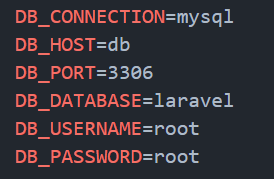

# Dockerize your PHP Laravel, MySQL Application

We will need 3 different services for this setup:
Nginx Server
PHP Server
MySQL Server

## Directory Structure


## Nginx Service

We will be using Nginx as the reverse proxy, the role of Nginx will be to listen on port 80 and pass the request to the PHP server so that it can process that request.
In the root folder create a file called docker-compose.yml and add the following code to it.

```bash
version: "3"
services:
  nginx:
    build:
      context: .
      dockerfile: nginx/Dockerfile
    ports:
      - "8080:80"
    networks:
      - internal
    volumes:
      - ./:/var/www/html/
      - ./logs/nginx:/var/log/nginx/
    container_name: nginx
networks:
  internal:
    driver: bridge
```

Create a folder called Nginx in the dockerize_laravel folder and create a file called Dockerfile in it having the following code. This file creates a docker container from nginx:alpine image and copies the Nginx configuration files from the local disk to the docker container.

```bash
FROM nginx:alpine
ADD nginx/default.conf /etc/nginx/conf.d
ADD nginx/fastcgi-php.conf /etc/nginx
```

Create a file called fastcgi-php.conf in the Nginx folder and the following code in it. This file defines the FastCGI config for handing PHP requests in Nginx.

```bash
# regex to split $uri to $fastcgi_script_name and $fastcgi_path
fastcgi_split_path_info ^(.+?\.php)(/.*)$;

# Check that the PHP script exists before passing it
try_files $fastcgi_script_name =404;

# Bypass the fact that try_files resets $fastcgi_path_info
# see: http://trac.nginx.org/nginx/ticket/321
set $path_info $fastcgi_path_info;
fastcgi_param PATH_INFO $path_info;

fastcgi_index index.php;
include fastcgi.conf;
```

Create a file called default.conf in the nginx folder and the following code in it. This file defines the Nginx configuration for the reverse proxy which listens to the request on port 80 and passes it to the PHP service which is listening on port 9000.

```bash
server {
    listen 80;
    listen [::]:80;
    root /var/www/html/public/;
    index index.php index.html index.htm index.nginx-debian.html;

    location / {
        try_files $uri $uri/ /index.php?$query_string;
    }

    # location / {
    #     index index.php index.html;
    # }

    location ~ \.php$ {
        include fastcgi_params;
        include fastcgi-php.conf;
        fastcgi_pass php:9000;
    }
}
```

Now your Nginx container configuration is completed.

## PHP Service

This one is simple. Just create a folder called PHP in the dockerize_laravel folder and create a file called Dockerfile in it with the following code.

```bash
FROM php:8.1-fpm

# Install system dependencies
RUN apt-get update && apt-get install -y \
    git \
    curl \
    libpng-dev \
    libonig-dev \
    libxml2-dev \
    zip \
    unzip

# Clear cache
RUN apt-get clean && rm -rf /var/lib/apt/lists/*

# Install PHP extensions
RUN docker-php-ext-install pdo_mysql mbstring exif pcntl bcmath gd

# Get latest Composer
COPY --from=composer:latest /usr/bin/composer /usr/bin/composer
```

This will create a docker container from PHP fpm image (make sure to check the correct fpm version required for your Laravel version else you will end up with an error). This will also install composer and all the required PHP extensions in the container.

Now add the following code in the docker-compose.yml file

```bash
php:
    build:
      context: .
      dockerfile: php/Dockerfile
    networks:
      - internal
    volumes:
      - ./:/var/www/html/
      - ./logs/php.log:/var/log/fpm-php.www.log
    container_name: php
    expose:
      - "9000"
```

## MySQL Service

Now this one is the simplest of all. Add the following code in the docker-compose.yml file and your MySQL service is done.

```bash
\mysql:
    container_name: db
    restart: always
    image: mysql:latest
    platform: linux/x86_64
    ports:
     - "3306:3306"
    environment:
      MYSQL_ROOT_PASSWORD: 'root'
      MYSQL_USER: 'hoang'
      MYSQL_PASS: 'password'
    volumes:
      - ./db-data:/var/lib/mysql
    networks:
      - internal
```

## Final docker-compose.yml

This final docker-compose.yml will look something like this.

```bash
version: "3"
services:
  nginx:
    build:
      context: .
      dockerfile: nginx/Dockerfile
    ports:
      - "8080:80"
    networks:
      - internal
    volumes:
      - ./application/:/var/www/html/
      - ./logs/nginx:/var/log/nginx/
    container_name: nginx
  php:
    build:
      context: .
      dockerfile: php/Dockerfile
    networks:
      - internal
    volumes:
      - ./application/:/var/www/html/
      - ./logs/php.log:/var/log/fpm-php.www.log
    container_name: php
    expose:
      - "9000"
  mysql:
    container_name: db
    restart: always
    image: mysql:latest
    platform: linux/x86_64
    ports:
     - "3306:3306"
    environment:
      MYSQL_ROOT_PASSWORD: 'root'
      MYSQL_USER: 'sushant'
      MYSQL_PASS: 'password'
    volumes:
      - ./db-data:/var/lib/mysql
    networks:
      - internal
networks:
  internal:
    driver: bridge
```

Modify the MySQL configuration in the .env file as follows.



### Now run the following command from the [your_app] folder to start all the 3 services

```bash
docker-compose up --build

```

### Right now you can run the following commands to create the database and run the migrations.

In a new terminal window go to the [your_app] folder and run the following commands

```bash
docker-compose exec mysql sh
mysql -uroot -proot
create database laravel;
quit
```

### Now open up a new terminal tab and cd into the [your_app] folder from there run the following commands to do a composer install in the container

```bash
docker-compose exec php sh
cd /var/www/html
composer install
```

### Run the following command to generate the application key in the .env file and run the migrations

```bash
php artisan key:generate
php artisan migrate
```

## Your beautiful Laravel application is up and running on localhost:8080


